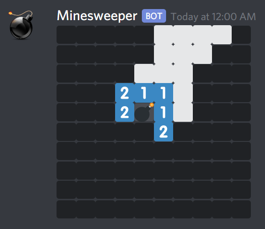

# Discord-Minesweeper
Greg Kennedy 2019

## About
Discord-Minesweeper is Perl script that generates Minesweeper boards for Discord chat.

On March 12, 2019, Discord [added support for the "Spoiler" tag](https://support.discordapp.com/hc/en-us/articles/360022320632-Spoiler-Tags-), which is enabled by surrounding some text in double pipes `||like this||`.  Spoiler text is hidden in the chat client until clicked by the user.  By using emoji and wrapping it in spoiler tags, it's possible to create a Minesweeper board that the player can uncover one cell at a time.

## Usage
Configuration is done by changes at the top of the script.  Three options control the board generation, while one is for posting the result to Discord.

* `HEIGHT` - controls the height of the generated board.
* `WIDTH` - controls the width of the generated board.
* `MINES` - how many mines to hide in the board.
* `URL` - the [Discord WebHook URL](https://support.discordapp.com/hc/en-us/articles/228383668-Intro-to-Webhooks).

(Note that very high values for `HEIGHT` or `WIDTH` may exceed Discord's maximum message size limit, and very high values for `MINES` may cause slow or infinite loops during mine placement and initial square reveal.)

Once configured with a URL, simply run the script to post a game to your chat channel.  You may wish to add this to `crontab` and get boards automatically posted once a day!

## Dependencies
Posting to Discord requires the `WebService::Discord::Webhook` module.  It is available [on CPAN](https://metacpan.org/pod/WebService::Discord::Webhook) or [on GitHub](https://github.com/greg-kennedy/p5-WebService-Discord-Webhook).

## License
This software is released under the Unlicense.  It is public domain software.  See `LICENSE` for more details.
